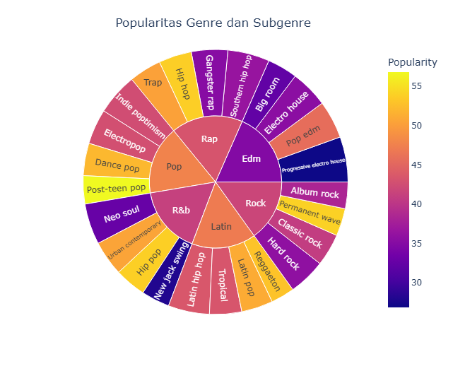
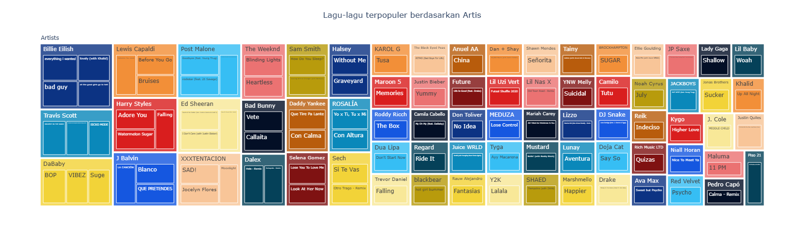
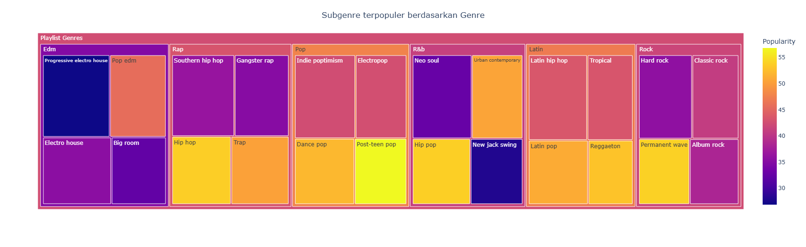
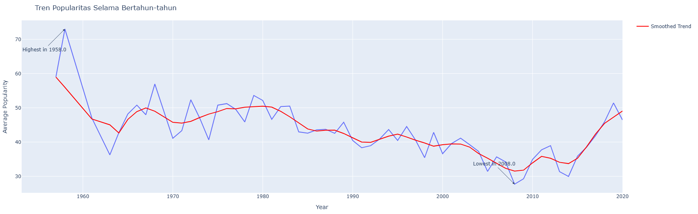
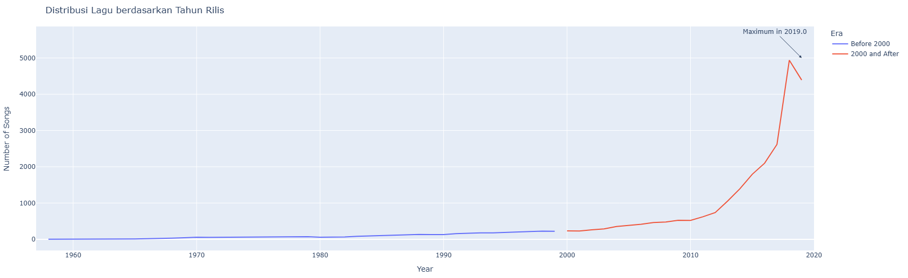
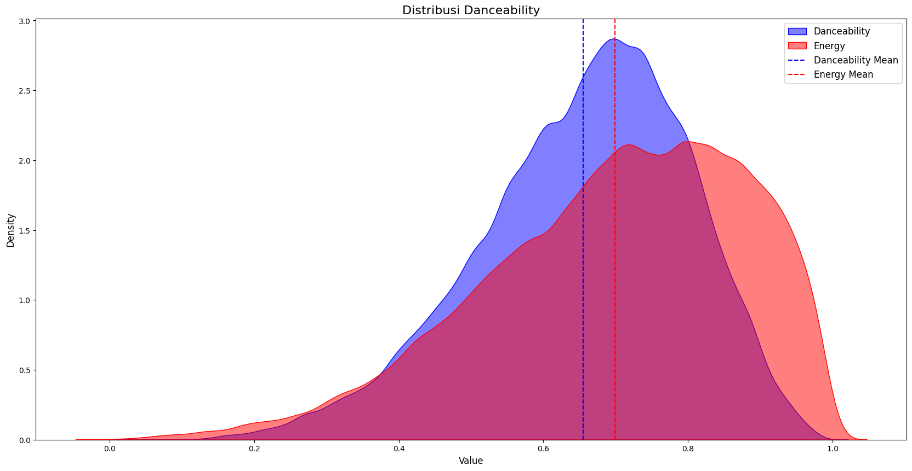

# Laporan Proyek Akhir Mata Kuliah

## Tentang Proyek 🎵
Proyek ini bertujuan untuk menganalisis dataset Spotify menggunakan pendekatan eksplorasi data dan visualisasi. Kami mengeksplorasi popularitas lagu berdasarkan genre, tahun rilis, dan fitur audio seperti danceability, tempo, dan durasi. Hasil analisis ini diharapkan dapat memberikan wawasan yang berharga bagi industri musik dalam memahami tren dan preferensi pendengar.

---

## Dataset 📂
Dataset yang digunakan dalam proyek ini berasal dari Spotify, yang mencakup informasi lagu seperti nama, artis, popularitas, genre, durasi, dan fitur audio lainnya. Dataset ini tersedia untuk diunduh melalui tautan berikut:

- [Spotify Dataset](#[./Dataset/spotify_songs.csv](https://github.com/Dhimz1157/ProjectBigData/blob/7ee8da73a144ee7896b765cfc9ad6ffea4f092d1/Dataset/spotify_songs.csv))

---

## Analisis Data 📊

### Tipe Data
Dataset terdiri dari 23 kolom, dengan kombinasi tipe data numerik dan kategorikal. Kolom numerik seperti `track_popularity` dan `danceability` digunakan untuk analisis statistik, sementara kolom kategorikal seperti `playlist_genre` digunakan untuk segmentasi data.

### Wawasan Utama
1. **Popularitas Genre dan Subgenre:**
   - Genre `pop` adalah yang paling populer, dengan rata-rata popularitas 47,74.
   - Subgenre `dance pop` menonjol dengan rata-rata popularitas 52,08.

2. **Lagu Terpopuler Berdasarkan Artis:**
   - "Dance Monkey" oleh Tones and I mencapai popularitas tertinggi (100).
   - "ROXANNE" oleh Arizona Zervas mengikuti dengan skor hingga 99.

3. **Distribusi Berdasarkan Tahun Rilis:**
   - Lagu tertua dalam dataset dirilis pada tahun 1957.
   - Tren popularitas menunjukkan fluktuasi sepanjang dekade, mencerminkan perubahan preferensi pendengar.

4. **Distribusi Danceability:**
   - Rata-rata danceability adalah 0,65, dengan sebagian besar lagu berada di rentang 0,56-0,76.

---

## Analisis Data Tambahan 📊

### 1. Popularitas Genre dan Subgenre
Berdasarkan visualisasi di atas, genre `pop` mendominasi popularitas dengan rata-rata tertinggi, diikuti oleh genre `latin`, `rap`, dan `r&b`. Subgenre `dance pop` menjadi yang paling menonjol dalam kategori `pop`, sedangkan `reggaeton` dan `latin pop` mendominasi dalam genre `latin`.

### 2. Lagu-lagu Terpopuler Berdasarkan Artis
Dari analisis ini, "Dance Monkey" oleh Tones and I memiliki popularitas tertinggi dengan skor 100. Lagu-lagu seperti "ROXANNE" oleh Arizona Zervas juga menonjol, menunjukkan bagaimana tren media sosial dapat memengaruhi popularitas.

### 3. Subgenre Terpopuler Berdasarkan Genre
Dalam kategori `pop`, subgenre `post-teen pop` mencatatkan popularitas tertinggi dengan rata-rata 56,83. Sedangkan dalam kategori `latin`, subgenre `reggaeton` mendominasi dengan popularitas rata-rata 52,87.

### 4. Distribusi Lagu Berdasarkan Tahun Rilis
Visualisasi menunjukkan bahwa lagu-lagu dari tahun 1957 adalah yang tertua dalam dataset ini. Selain itu, ada peningkatan signifikan dalam jumlah lagu yang dirilis pada dekade 2010-an, mencerminkan ekspansi industri musik pada platform digital.

### 5. Tren Popularitas Selama Bertahun-tahun
Tahun 1958 mencatatkan rata-rata popularitas tertinggi dengan skor 73, kemungkinan karena terbatasnya data dari era tersebut. Tren berikutnya menunjukkan fluktuasi popularitas lagu dari waktu ke waktu.

### 6. Distribusi Danceability
Sebagian besar lagu memiliki danceability antara 0,56 hingga 0,76, dengan rata-rata 0,65. Hal ini menunjukkan bahwa sebagian besar lagu memiliki karakteristik yang cukup menarik untuk aktivitas fisik seperti menari.

---

## Visualisasi 📈
Grafik yang dihasilkan mencakup:
- **Histogram Popularitas Lagu**: Menunjukkan mayoritas lagu berada di tingkat popularitas menengah.
- **Plot Distribusi Tempo**: Tempo rata-rata adalah 120 BPM.
- **Durasi Lagu**: Sebagian besar lagu berdurasi antara 2,5 hingga 4 menit.

---

## Rangkuman dan Implikasi 📋
### Kesimpulan
Analisis ini menunjukkan bahwa genre `pop` dan subgenre `dance pop` mendominasi popularitas, mencerminkan preferensi global terhadap lagu-lagu dengan beat yang menarik. Lagu seperti "Dance Monkey" menjadi bukti pengaruh viralitas terhadap kesuksesan global.

### Saran
Integrasi data tambahan seperti demografi pendengar dapat memberikan wawasan yang lebih kaya. Selain itu, model prediktif dapat digunakan untuk memperkirakan popularitas lagu baru berdasarkan fitur audio.

---

## Kontribusi 🤝
Kontribusi sangat disambut! Silakan buat pull request untuk penambahan fitur atau perbaikan bug.

---

## Lisensi 📜
Proyek ini dilisensikan di bawah MIT License.
